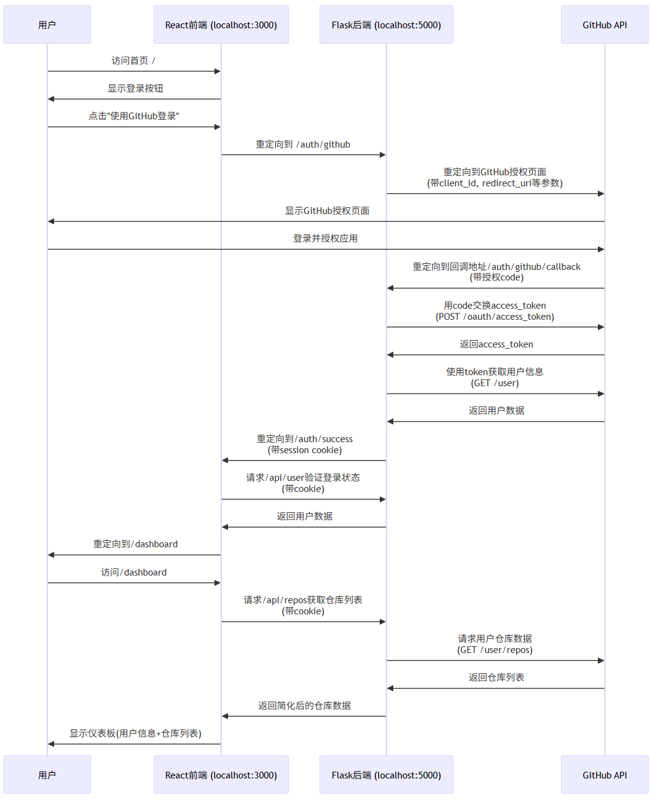
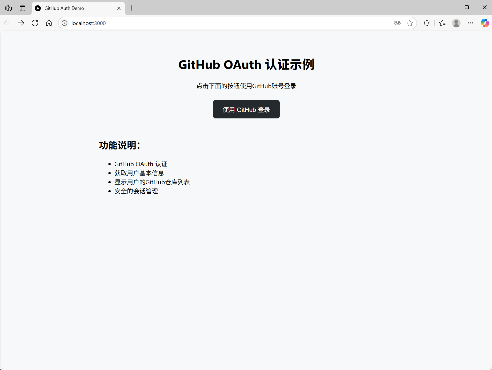

# GitHub OAuth 认证示例

这是一个使用 GitHub OAuth 进行用户认证的全栈应用示例，包含 Flask 后端和 React 前端。

## 流程图

## 功能特性

- ✅ GitHub OAuth 认证
- ✅ 获取用户基本信息
- ✅ 显示用户的 GitHub 仓库列表
- ✅ 安全的会话管理
- ✅ 响应式用户界面

## 技术栈

### 后端
- **Flask** - Python Web 框架
- **Flask-CORS** - 跨域资源共享
- **Requests** - HTTP 库
- **Session** - 会话管理

### 前端
- **React** - 用户界面库
- **React Router** - 路由管理
- **Axios** - HTTP 客户端
- **CSS3** - 样式设计

## 项目结构

```
github_auth/
├── app.py                 # Flask 后端应用
├── package.json          # Node.js 依赖配置
├── public/
│   └── index.html        # HTML 模板
├── src/
│   ├── App.js            # React 主应用组件
│   ├── App.css           # 应用样式
│   ├── index.js          # React 入口文件
│   └── components/
│       ├── Home.js       # 首页组件
│       ├── AuthSuccess.js # 认证成功页面
│       └── Dashboard.js  # 用户仪表板
└── README.md
```

## 快速开始

### 前置要求

- Python 3.11+
- Node.js 16+
- GitHub 账号

### 1. 创建 GitHub OAuth 应用

1. 访问 [GitHub Developer Settings](https://github.com/settings/developers)
2. 点击 "New OAuth App"
3. 填写应用信息：
   - **Application name**: GitHub Auth Demo
   - **Homepage URL**: `http://localhost:3000`
   - **Authorization callback URL**: `http://localhost:5000/auth/github/callback`
4. 获取 `Client ID` 和 `Client Secret`

### 2. 配置环境

在 `app.py` 中更新你的 GitHub OAuth 配置：

```python
GITHUB_CLIENT_ID = 'your_client_id_here'
GITHUB_CLIENT_SECRET = 'your_client_secret_here'
```

### 3. 安装依赖

#### 后端依赖
```bash
# 使用 uv (推荐)
uv sync

# 或使用 pip
pip install flask flask-cors requests
```

#### 前端依赖
```bash
npm install
```

### 4. 启动应用

#### 启动后端服务器
```bash
# 使用 uv
uv run python app.py

# 或直接运行
python app.py
```

后端服务器将在 `http://localhost:5000` 启动

#### 启动前端开发服务器
```bash
npm start
```

前端应用将在 `http://localhost:3000` 启动

### 5. 使用应用

1. 打开浏览器访问 `http://localhost:3000`
2. 点击 "使用 GitHub 登录" 按钮
3. 在 GitHub 授权页面确认授权
4. 成功登录后查看用户信息和仓库列表

## API 端点

### 认证相关
- `GET /auth/github` - 重定向到 GitHub OAuth 授权页面
- `GET /auth/github/callback` - 处理 GitHub OAuth 回调
- `POST /api/logout` - 用户登出

### 用户数据
- `GET /api/user` - 获取当前登录用户信息
- `GET /api/repos` - 获取用户的 GitHub 仓库列表


