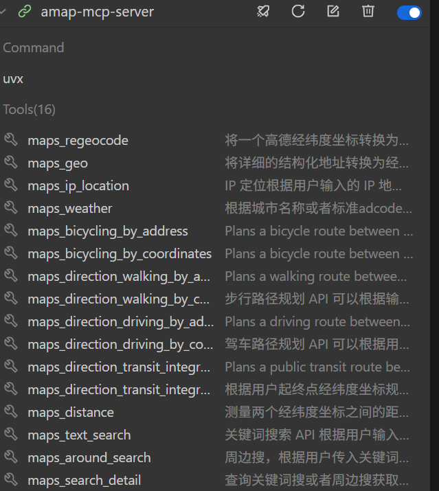
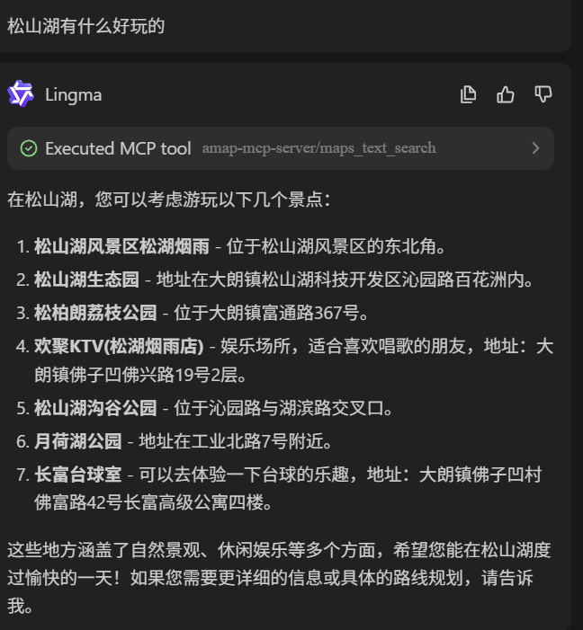
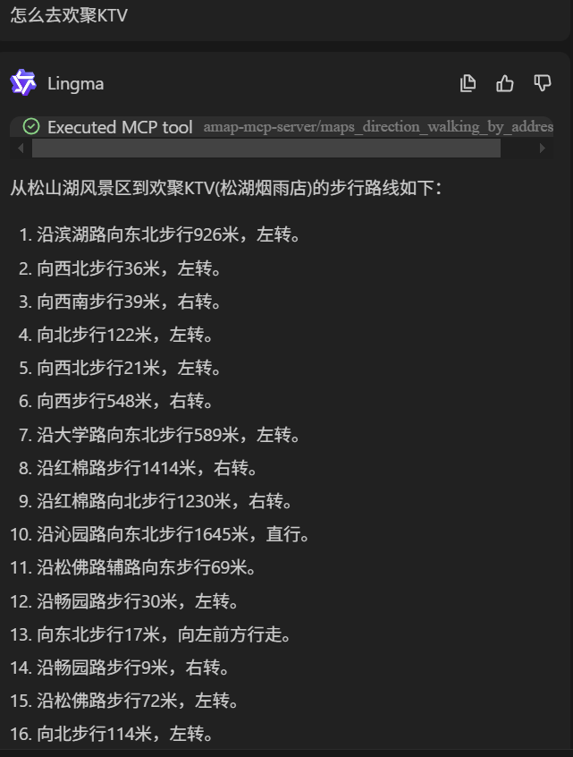

## 使用
### Api 申请
在[高德开放平台](https://lbs.amap.com/)注册并获取API密钥。

### 配置

直接在客户端配置如下MCP Server即可。

```json
{
    "mcpServers": {
        "amap-mcp-server": {
            "command": "uvx",
            "args": [
                "amap-mcp-server"
            ],
            "env": {
                "AMAP_MAPS_API_KEY": "your valid amap maps api key"
            }
        }
    }
}
```
配置成功后出现工具列表

### 运行

