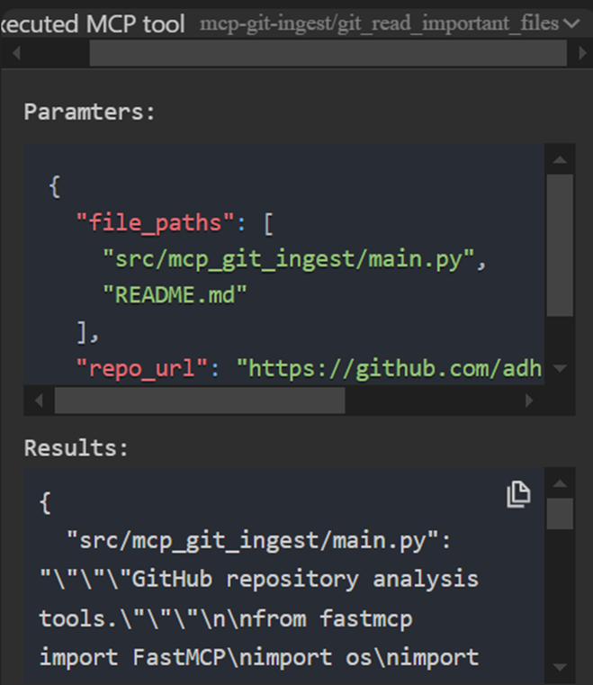

## 配置
{
    "mcpServers": {
        "mcp-git-ingest": {
            "command": "uvx",
            "args": ["--from", "git+https://github.com/adhikasp/mcp-git-ingest", "mcp-git-ingest"],
        }
    }
}
如Lingma IDE，需要配置如下：


注意需要翻墙，连接成功后出现

## 例子
`问题`:read https://github.com/adhikasp/mcp-git-ingest and determine how the code technically works
`回答`:


```toolCall::MCP#mcp-git-ingest#git_directory_structure::call_946a2fadbb9c4727a9f25f::INIT
```


```toolCall::MCP#mcp-git-ingest#git_read_important_files::call_b3a15d0b69254d898970e0::INIT
```


The `mcp-git-ingest` repository is a Model Context Protocol (MCP) server designed to help read GitHub repository structures and important files. Here's how the code technically works:

1. **Purpose**:
   - It provides two main tools:
     - `git_directory_structure`: Returns a tree-like representation of a repository's directory structure.
     - `git_read_important_files`: Reads and returns the contents of specified files in a repository.

2. **Technical Implementation**:
   - **Dependencies**:
     - Uses `fastmcp` for creating an MCP server.
     - Uses `gitpython` for Git repository operations.
     - Requires Python 3.8+.

   - **Key Functions**:
     - `clone_repo(repo_url: str) -> str`:
       - Creates a deterministic temporary directory based on the repository URL's hash.
       - Checks if the repository is already cloned.
       - If not, clones the repository.
       - Handles error cases and cleanup.
       - Returns the path to the cloned repository.

     - `get_directory_tree(path: str, prefix: str = "") -> str`:
       - Recursively generates a tree-like directory structure.
       - Skips `.git` directories.
       - Uses Unicode box-drawing characters to create a visual tree representation.
       - Handles sorting of entries.

     - `git_directory_structure(repo_url: str) -> str`:
       - Clones the repository.
       - Generates directory tree.
       - Cleans up the temporary repository after processing.
       - Returns the tree structure or an error message.

     - `git_read_important_files(repo_url: str, file_paths: List[str]) -> dict[str, str]`:
       - Clones the repository.
       - Reads specified files.
       - Returns a dictionary mapping file paths to their contents.
       - Handles file reading errors.
       - Cleans up the temporary repository.

3. **Error Handling**:
   - Uses try-except blocks to handle repository cloning and file reading errors.
   - Ensures temporary directories are always cleaned up using `finally` blocks.
   - Returns descriptive error messages.

4. **Performance Optimizations**:
   - Uses a hash-based temporary directory naming to potentially reuse cloned repositories.
   - Checks for existing repositories before cloning.
   - Implements cleanup to prevent accumulation of temporary files.

5. **Unique Features**:
   - Deterministic temporary directory creation.
   - Unicode tree representation.
   - Flexible file reading with error handling.

6. **Execution**:
   - Can be run as a CLI tool via `mcp-git-ingest`.
   - Configured through [pyproject.toml](file://d:\agent-llm\mcp_ser\jupyter-notebook-mcp\pyproject.toml).
   - Depends on `fastmcp` for MCP server functionality.

The code is a robust, flexible tool for programmatically exploring and reading GitHub repositories, with a focus on error handling and clean implementation.

参考链接：https://github.com/adhikasp/mcp-git-ingest